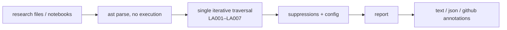

# lookahead-lint

[](https://github.com/bmouler/lookahead-lint/actions/workflows/ci.yml)


[](LICENSE)

A static analyzer that flags look-ahead bias and target leakage in Python and Jupyter research
code, using the standard library only and nothing else.

Try it in your browser with the [zero-upload playground](https://bmouler.github.io/lookahead-lint/).

Look-ahead bias does not announce itself. A backtest with `.shift(-1)` in the feature block or a
scaler fitted before the split produces a beautiful equity curve and then loses money in
production, because the model was scored on information it could not have had. The idioms that
cause it are a small, recognizable set of pandas and scikit-learn calls, and a machine can find
them in the diff instead of in the post-mortem. This tool checks for exactly those idioms and is
tuned for a low false positive rate: every rule fires on a literal, unambiguous construct, and
anything it cannot decide from the syntax it leaves alone.

## Install

Install the stable release from PyPI:

```console
python -m pip install lookahead-lint
```

For editable development, clone the repository and include the development tools:

```console
python -m pip install -e ".[dev]"
```

Python 3.11 or newer. There are no runtime dependencies.

## Quickstart

Run it on the leaking example that ships with the repository:

```
$ lookahead-lint examples/leaky_research.py
examples/leaky_research.py
  31:26  LA001  negative shift pulls future rows into the present; legitimate only for label construction, which should be suppressed inline [periods=-1]
  32:25  LA003  centered rolling window includes observations after the current bar
  33:23  LA002  backward fill propagates a later observation onto an earlier timestamp [bfill()]
  34:26  LA002  backward fill propagates a later observation onto an earlier timestamp [fillna(method='backfill')]
  35:26  LA002  backward fill propagates a later observation onto an earlier timestamp [interpolate(limit_direction='both')]
  41:12  LA007  merge_asof with a forward/nearest direction matches rows dated after the key [direction='forward']
  49:24  LA006  index offset ahead of the loop variable reads a row that has not happened yet
  58:14  LA004  fit call precedes train_test_split in this scope; statistics are learned on test rows [split at line 59]
  59:40  LA005  train_test_split is not pinned to shuffle=False, so future rows enter training

rules
  LA001 negative-shift
    why: A negative shift reads values that are not observable at the row's timestamp.
    fix: Shift features backward (positive periods) instead. For a label, keep the shift and add '# lookahead-lint: ignore[LA001]' so the intent stays visible in review.
  LA002 backward-fill
    why: Filling backward copies data from the future into rows that predate it.
    fix: Use forward fill (.ffill(), method='ffill', limit_direction='forward') so gaps are filled only from already-observed values.
  LA003 centered-window
    why: A window centered on t spans (t - w/2, t + w/2), so half of it is unobservable.
    fix: Drop center=True; a trailing window (the pandas default) only sees the past.
  LA004 fit-before-split
    why: Statistics fitted on the full frame encode the held-out distribution.
    fix: Split first, fit on the training rows only, then transform the held-out rows.
  LA005 shuffled-split
    why: Random splits of a time-ordered frame place later rows before earlier ones.
    fix: Pass shuffle=False for ordered data, or split on an explicit date boundary.
  LA006 future-row-index
    why: Reading position i + k inside a loop over i consumes a bar from the future.
    fix: Read the current or a past position (i, i - 1). If you need the next bar as a label, build it once as a shifted column and suppress that line explicitly.
  LA007 forward-asof-merge
    why: Only direction='backward' produces a point-in-time join.
    fix: Use direction='backward' (the default) so each row joins the most recent prior record.

9 findings in 1 file (1 file checked)
$ echo $?
1
```

`examples/clean_research.py` is the same script with every leak repaired. It still builds a
forward-shifted label, because a label has to look forward; that one line carries an inline
suppression so the intent is visible instead of silenced:

```
$ lookahead-lint examples/clean_research.py
no findings (1 file checked)
$ echo $?
0
```

Notebooks are analyzed cell by cell and reported in cell coordinates. This is the CI-facing
format, which GitHub renders as inline annotations on the pull request diff:

```
$ lookahead-lint examples/leaky_notebook.ipynb --format github
::warning file=examples/leaky_notebook.ipynb,line=9,col=20,title=LA001 negative-shift::[cell 2, line 2] negative shift pulls future rows into the present; legitimate only for label construction, which should be suppressed inline [periods=-1]. Fix: Shift features backward (positive periods) instead. For a label, keep the shift and add '# lookahead-lint: ignore[LA001]' so the intent stays visible in review.
::warning file=examples/leaky_notebook.ipynb,line=10,col=19,title=LA003 centered-window::[cell 2, line 3] centered rolling window includes observations after the current bar. Fix: Drop center=True; a trailing window (the pandas default) only sees the past.
::warning file=examples/leaky_notebook.ipynb,line=15,col=15,title=LA005 shuffled-split::[cell 3, line 4] train_test_split is not pinned to shuffle=False, so future rows enter training. Fix: Pass shuffle=False for ordered data, or split on an explicit date boundary.
```

And the machine-readable format, narrowed to two rules:

```
$ lookahead-lint examples/leaky_research.py --format json --select LA004,LA005
{
  "errors": [],
  "findings": [
    {
      "cell": null,
      "cell_line": null,
      "code": "LA004",
      "column": 14,
      "end_line": 58,
      "fix": "Split first, fit on the training rows only, then transform the held-out rows.",
      "line": 58,
      "message": "fit call precedes train_test_split in this scope; statistics are learned on test rows [split at line 59]",
      "name": "fit-before-split",
      "path": "examples/leaky_research.py",
      "rationale": "Statistics fitted on the full frame encode the held-out distribution."
    },
    {
      "cell": null,
      "cell_line": null,
      "code": "LA005",
      "column": 40,
      "end_line": 59,
      "fix": "Pass shuffle=False for ordered data, or split on an explicit date boundary.",
      "line": 59,
      "message": "train_test_split is not pinned to shuffle=False, so future rows enter training",
      "name": "shuffled-split",
      "path": "examples/leaky_research.py",
      "rationale": "Random splits of a time-ordered frame place later rows before earlier ones."
    }
  ],
  "schema_version": 1,
  "summary": {
    "errors": 0,
    "files_checked": 1,
    "findings": 2
  },
  "tool": "lookahead-lint"
}
```

## How it works



Each file is parsed with `ast` and traversed once while all seven independent rules evaluate
their relevant nodes. No code is imported or executed, so running the linter on someone else's
research is safe.

### Rules

| code | fires on | deliberately silent on |
| --- | --- | --- |
| LA001 | `.shift(-n)`, `.shift(periods=-n)` with a negative literal | `.shift(1)`, `.shift(n)` where `n` is a variable |
| LA002 | `.bfill()`, `fillna(method="bfill"/"backfill")`, `interpolate(limit_direction="backward"/"both")`, `reindex`/`asfreq`/`align` with a backward `method` | `.ffill()`, forward `method`, `interpolate()` with no direction |
| LA003 | `.rolling(..., center=True)` | `.rolling(...)`, `center=False`, `center=<variable>` |
| LA004 | `.fit(`/`.fit_transform(` on a line before the first `train_test_split(` in the same scope | fits after the split, fits with no split in scope, fits inside a nested function |
| LA005 | `train_test_split(...)` not pinned to `shuffle=False` | `shuffle=False`, or a call forwarding `**kwargs` |
| LA006 | `x[i + k]` inside a loop or comprehension whose target is `i` | `x[i]`, `x[i - 1]`, `x[i + -1]`, `x[i:i + 1]`, `x[j + 1]` for a non-loop `j` |
| LA007 | `merge_asof(..., direction="forward"/"nearest")` | the default and explicit `direction="backward"` |

The "deliberately silent" column is the design. A rule that needs to guess whether a variable is
negative, or whether an object is a DataFrame, is a rule that will eventually be wrong in front of
a colleague, so those cases are left alone. LA004 in particular is a pure line-ordering check
within a single scope, not a dataflow analysis: it compares the line of each fit call against the
first `train_test_split` in the same function, class, or module body, and it never reaches across
scope boundaries.

Rule identity is stable: codes are never reused or renumbered, and the JSON payload carries a
`schema_version` that only changes on a breaking field change.

### Suppression

A trailing comment silences a line:

```python
target = close.pct_change().shift(-1)  # lookahead-lint: ignore[LA001] label
smooth = close.shift(-1).rolling(5, center=True)  # lookahead-lint: ignore[LA001, LA003]
vendor = quotes.bfill()  # lookahead-lint: ignore
```

Comments are read with `tokenize`, not with a regex over the raw source, so the directive text
inside a string literal or a docstring is treated as data and suppresses nothing. For a call
spanning several lines, the directive may sit on any line of that call, including the closing
parenthesis where a reader would naturally put it.

### Notebooks

`.ipynb` files are read as JSON. Code cells are concatenated in document order so that
scope-level checks still see the whole notebook; markdown and raw cells are skipped and do not
consume a cell number. A cell that is valid Python is never modified. Only a cell that fails to
parse is stripped of IPython magics (`%matplotlib inline`), shell escapes (`!pip install ...`) and
assignments from them (`files = !ls`), each replaced by an empty line so numbering is preserved.
Findings are reported as `cell N, line M`.

### Configuration

Everything is optional. An unrecognized key, an unknown rule code, or a value of the wrong type is
an error rather than a silent no-op:

```toml
[tool.lookahead_lint]
select = ["LA001", "LA002", "LA004"]
ignore = ["LA005"]
exclude = ["notebooks", "*_generated.py"]
```

The table is discovered by walking up from the first path given on the command line.
`--select` and `--ignore` override the file, and `--no-config` skips discovery entirely.
`exclude` applies to directory recursion; a file named explicitly on the command line is always
analyzed. Some directories (`.git`, `.venv`, `__pycache__`, `build`, `dist`, and similar) are
always skipped.

### Exit codes

| code | meaning |
| --- | --- |
| 0 | no findings |
| 1 | at least one finding survived suppression |
| 2 | usage error, bad configuration, or a file that could not be analyzed |

A file that fails to parse is reported with its `SyntaxError` position and does not stop the run;
the remaining files are still analyzed and the run ends with exit code 2. Silently skipping an
unparseable file would be the worst possible behaviour for a tool whose value is coverage.

## Verification

The deterministic property suite exercises rule detection, clean-code composition, analyzer purity,
and every output format. Static types are checked with strict mypy, and CI enforces 100% statement
and branch coverage on Linux and macOS with Python 3.11–3.13.

### End-to-end performance

`PYTHONPATH=src python benchmarks/benchmark_analysis.py --samples 15 --warmups 3` parses a
deterministic 104,934-byte research module, evaluates all seven rules, materializes 1,440
findings, and renders the default text report. Source generation and interpreter startup are
outside the timed region.

On an Apple M3 Max with CPython 3.11.12 on 2026-08-15, the frozen baseline
`05b02286b14a` measured **131.195 ms** median and the single-traversal implementation
**55.940 ms**, a **2.345x speedup**. Fifteen samples after three warmups produced the same
SHA-256 `b19761066efde446a2a16b53dea978ad74c2138c75dc84d974296d86064f474b` in both
runs. These are local in-process timings; rerun with `PYTHONPATH` pointed at the desired
source worktree.

### Mutation testing

Reproduce the mutation baseline from the repository root:

```console
source .venv/bin/activate
mutmut run
mutmut results
```

Current baseline: **1,109 of 1,122 mutants killed (98.84%; 98% floor)**, with zero suspicious
results or timeouts. The 13 survivors are reviewed runtime-equivalent mutations:

| Equivalent group | Count | Why behavior is identical |
|---|---:|---|
| `typing.cast` target changes | 9 | `typing.cast` returns its value unchanged at runtime. |
| `ast.parse` filename metadata | 2 | Parse failures are normalized into `LintError` using the separately supplied path. |
| Explicit `detail=None` removal | 2 | The report helper's default is already `None`, producing the same `Finding`. |

## Limitations

- Syntax only. `df.bfill` assigned to a variable and called later, a fill hidden behind a helper
  function, or a leak expressed through a library the analyzer has never heard of will all pass.
- No type information. The checks match method names, so a non-pandas object with a `.bfill()`
  method is a false positive. In practice this is rare enough to be worth the recall.
- LA004 compares line numbers, not execution order. A fit inside a loop body that runs after a
  split written above it is not flagged, and a fit textually above a split that is never reached
  is flagged.
- LA006 only understands `+` with the loop variable as a direct operand. `x[i + offset]` is
  flagged when `offset` is unknown, and `x[idx[i] + 1]` is not flagged at all.
- Notebook line numbers in the `github` format point into the concatenated cell source, not into
  the `.ipynb` JSON file, so GitHub cannot place a notebook annotation on the exact diff line. The
  cell coordinates in the message are the actionable location.
- A finding is evidence to check, not proof of a bug. Reading the flagged line is still your job.

## Non-goals

- Not a runtime or dataflow checker. There is no execution, no import, no tracing, and no attempt
  to prove that a value is contaminated.
- Not a backtest validator. It says nothing about whether a strategy is any good, and it does not
  compute performance statistics.
- No multiple-testing machinery. Overfitting is a validation problem, addressed by held-out data
  across instruments and periods, not by a p-value correction bolted onto a linter.
- No autofix. Every one of these findings is a modelling decision, and rewriting research code
  behind the author's back is how a linter loses trust.
- No plugin system, no custom rule DSL, no configuration beyond three keys. The rule set is small
  on purpose; if a rule cannot be made precise, it does not ship.

## License

MIT. See [LICENSE](LICENSE).
